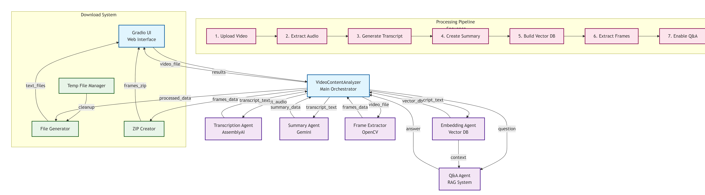

# 🎥 Video Content Analyzer - Agentic AI System

## 📋 Table of Contents
1. [Project Overview](#project-overview)
2. [Problem Statement](#problem-statement)
3. [Solution Architecture](#solution-architecture)
4. [Agentic AI Concepts Implemented](#agentic-ai-concepts-implemented)
5. [System Components](#system-components)
6. [Tech Stack](#tech-stack)
7. [Setup Instructions](#setup-instructions)
8. [Usage Guide](#usage-guide)
9. [Demo Video](#demo-video)
10. [Future Enhancements](#future-enhancements)

---

## 🎯 Project Overview

The Video Content Analyzer is an intelligent multi-agent AI system that automatically processes video files to extract, analyze, and enable intelligent querying of video content. The system uses specialized AI agents working together to provide transcription, summarization, semantic search, and interactive Q&A capabilities.

---

## 🔍 Problem Statement

People spend hours watching lengthy videos (lectures, meetings, tutorials, interviews) to find specific information. Current challenges include:

- **Time-consuming:** Watching entire videos to find specific information
- **Inefficient:** No way to search video content semantically
- **Limited accessibility:** Difficulty reviewing or referencing video content later
- **Poor indexing:** Videos lack searchable transcripts and summaries

---

## 💡 Solution Architecture

Our system employs a multi-agent architecture where specialized AI agents collaborate to process and analyze video content:

### High-Level Architecture

### Agent Workflow

1. **Transcription Agent**: Extracts audio and converts speech to text
2. **Summary Agent**: Generates intelligent summaries and chapter markers
3. **Embedding Agent**: Creates semantic vectors and stores in vector database
4. **Q&A Agent**: Answers questions using RAG (Retrieval Augmented Generation)
5. **Frame Extractor**: Extracts key visual frames with timestamps

---

## 🤖 Agentic AI Concepts Implemented

### 1. **Multi-Agent System**
- Multiple specialized agents with distinct responsibilities
- Each agent focuses on one task (separation of concerns)
- Agents work independently but coordinate through orchestrator

### 2. **Agent Tools & Resources**
- **Tools**: AssemblyAI API, Gemini API, OpenCV, MoviePy
- **Resources**: Video files (MP4, MOV, AVI formats)
- **External APIs**: Cloud-based AI services for processing

### 3. **Agentic Workflows**
- **Sequential workflow**: Transcription → Summary → Embedding → Ready for Q&A
- **Parallel potential**: Frame extraction runs independently
- **Orchestration**: Central coordinator manages agent execution

### 4. **Agentic Patterns**

#### a) **Tool Use Pattern**
- Agents use external tools (APIs, libraries) to accomplish tasks
- AssemblyAI for transcription, Gemini for text generation

#### b) **RAG Pattern (Retrieval Augmented Generation)**
- Q&A Agent retrieves relevant context from vector DB
- Augments LLM prompts with retrieved information
- Generates grounded, accurate answers

#### c) **Memory & Context**
- Transcript stored for all agents to access
- Vector database maintains semantic memory
- Session persistence for continuous Q&A

### 5. **Handoffs Between Agents**
- Transcription Agent → passes transcript → Summary Agent
- Transcription Agent → passes transcript → Embedding Agent
- Embedding Agent → provides search capability → Q&A Agent

### 6. **Vector Storage & Semantic Search**
- ChromaDB stores embeddings of transcript chunks
- Enables semantic similarity search (not just keyword matching)
- Powers intelligent Q&A capabilities

### 7. **Guardrails**
- Error handling in each agent
- Input validation for video files
- API rate limiting awareness
- Context length management for LLMs

### 8. **Persistence**
- Transcript saved to file
- Summary saved to file
- Vector database persists embeddings
- Extracted frames saved to disk

---

## 🏗️ System Components

### 1. **Transcription Agent**
**Responsibility:** Convert video speech to text

**Process:**
- Extracts audio from video using MoviePy
- Sends audio to AssemblyAI for transcription
- Returns timestamped transcript

**Output:** Full text transcript with word-level timestamps

---

### 2. **Summary Agent**
**Responsibility:** Create intelligent summaries

**Process:**
- Analyzes full transcript using Gemini
- Generates structured summary with key points
- Creates logical chapter markers

**Output:** 
- Main topic summary
- Key points (bullet format)
- Chapter breakdown

---

### 3. **Embedding Agent**
**Responsibility:** Enable semantic search

**Process:**
- Chunks transcript into overlapping segments (500 words)
- Generates embeddings using Gemini embedding model
- Stores vectors in ChromaDB

**Output:** Populated vector database ready for queries

---

### 4. **Q&A Agent**
**Responsibility:** Answer user questions about video

**Process:**
- Receives user question
- Searches vector DB for relevant transcript chunks
- Uses retrieved context + Gemini to generate answer
- Implements RAG pattern

**Output:** Natural language answers with source attribution

---

### 5. **Frame Extractor**
**Responsibility:** Extract visual timeline

**Process:**
- Opens video file with OpenCV
- Extracts frames at regular intervals
- Saves frames with timestamps

**Output:** 5-10 key frames representing video timeline

---

## 🛠️ Tech Stack

### **Frontend**
- **Gradio**: Web interface for video upload and interaction
- Hosted in Google Colab for easy deployment

### **Backend & Orchestration**
- **Python**: Core programming language
- **Custom Orchestrator**: Coordinates agent workflows

### **AI/ML Services**
- **OpenAI Whisper (via AssemblyAI)**: Speech-to-text transcription
- **Google Gemini API**: 
  - Text generation (summaries, Q&A)
  - Embeddings generation
- **ChromaDB**: Vector database for semantic search

### **Video Processing**
- **MoviePy**: Audio extraction from video
- **OpenCV**: Frame extraction and processing

### **Additional Libraries**
- **LangChain**: Framework utilities
- **tiktoken**: Token counting for LLMs

### **Hosting**
- **Google Colab**: Development and testing
- **Hugging Face Spaces** (optional): Final deployment

---

## 🚀 Setup Instructions

### Prerequisites
- Google Account (for Colab)
- OpenAI API key or Google Gemini API key
- AssemblyAI API key (free tier available)

## 🚀 Setup Instructions

### Step 1: Open in Colab
1. Open the notebook in Google Colab
2. Run the installation cell to install all dependencies

### Step 2: Set Up API Keys  
1. Click the 🔑 (key) icon in Colab's left sidebar
2. Add your secrets:
   - `ASSEMBLYAI_API_KEY` = your_assemblyai_key_here
   - `GEMINI_API_KEY` = your_gemini_key_here

### Step 3: Run the Application
1. Run all cells sequentially
2. The Gradio interface will launch at the bottom
3. Upload your video and start analyzing!

## 📖 Usage Guide

"you can view the demo for more clarity!"
### Step 1: Upload Your Video
1. **Launch the Gradio interface** after running all cells
2. **Drag and drop** your video file (supports MP4, MOV, AVI formats)
3. **Click Upload** to begin processing

### Step 2: Automatic Multi-Agent Processing
The system will automatically process your video through all agents:

- **🔄 Transcription Agent**: Extracts audio and converts to text (2-5 minutes)
- **📝 Summary Agent**: Generates intelligent summary and chapters (1-2 minutes)  
- **🔍 Embedding Agent**: Creates searchable vector database (1 minute)
- **🖼️ Frame Extractor**: Captures key visual frames (30 seconds)

*Total processing time: 5-10 minutes depending on video length*

### Step 3: Access Results
Once processing completes, you can:

#### **View Transcript**
- Full timestamped text of all spoken content
- Word-level accuracy with speaker detection

#### **Read Summary**  
- **Main Summary**: Concise overview of video content
- **Key Points**: Bulleted list of important information
- **Chapter Markers**: Logical breakdown with timestamps

#### **Ask Questions (Q&A Interface)**
1. **Type any question** about the video content
2. **Get instant answers** with relevant transcript excerpts
3. **Examples**:
   - "What were the main conclusions?"
   - "When did they discuss pricing?"
   - "Summarize the technical specifications"

#### **Browse Key Frames**
- Visual timeline of important moments
- Click frames to jump to specific timestamps

### Step 4: Advanced Features
- **Semantic Search**: Find content by meaning, not just keywords
- **Multi-turn Q&A**: Ask follow-up questions with context
- **Export Results**: Download transcript, summary, and frames

### 💡 Pro Tips
- **For long videos**: Processing time scales linearly with duration
- **Clear audio**: Better audio quality = more accurate transcription
- **Specific questions**: Get better answers with precise queries
- **Use timestamps**: Click any timestamp to navigate the original video

## Demo

view online:
[loom link to demo!](https://www.loom.com/share/ee443116d178425091c74fb0b06a3ff9)

download demo:

## 🔮 Future Enhancements

### 🎯 Top Priority Features (Coming Soon)

#### 1. Multi-language Support 🌍
- Auto-detect and process videos in Spanish, Chinese, French, Arabic, and Hindi
- Translate summaries and Q&A while preserving original transcripts
- Support for 20+ major global languages

#### 2. Speaker Identification & Diarization 🗣️  
- Automatically separate and label different speakers in conversations
- Visual speaker timeline with color-coded segments
- Filter content by specific speakers in Q&A

#### 3. Direct URL Processing 📹
- Analyze videos directly from YouTube URLs (no download needed)
- Google Drive and Dropbox integration
- Support for popular video platforms and cloud storage

#### 4. Interactive Video Player ⏯️
- Click any transcript text to jump to exact timestamp in video
- Side-by-side view of video player and analysis panels
- Chapter-based navigation with visual timeline

#### 5. Meeting Intelligence Features 👥
- Automatic action item extraction from meetings
- Key decision and conclusion identification
- Participant contribution analytics

### 🚀 Advanced Roadmap

#### Real-time Processing
- Live progress tracking for hour-long videos
- Stream partial results as they become available
- Background processing for multiple videos

#### Enhanced Visual Analysis  
- Object and scene detection in video frames
- OCR for text in slides and presentations
- Face detection with privacy options

#### Enterprise Features
- Team collaboration and shared workspaces
- Custom domain adapters (education, legal, medical)
- API access for developers

---

**Have specific feature requests?** Open an issue to help us prioritize development!